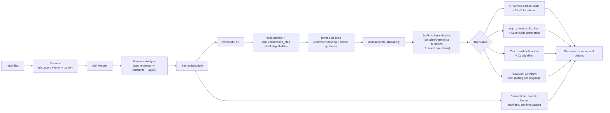

# llvm-dsdl Design

## 1. Purpose

`llvm-dsdl` is a compiler toolchain for [Cyphal DSDL](https://github.com/OpenCyphal/specification/tree/master/specification/dsdl), built to make one semantic interpretation of `.dsdl` definitions reusable across many target languages. DSDL describes message/service data contracts and wire behaviour. This project turns those contracts into language artifacts that can serialise and deserialise bytes consistently.

The project deliberately combines three ideas:

- DSDL as the domain language and source of truth for data contracts.
- LLVM/MLIR as compiler infrastructure for normalised IR and pass-managed transformations.
- Multi-language emitters that share lowered wire-semantics rather than re-implementing rules backend-by-backend.

This repo ships three user-facing tools:

- [`dsdlc`](tools/dsdlc/main.cpp): compile/codegen driver.
- [`dsdl-opt`](tools/dsdl-opt/main.cpp): pass-driver over the custom dialect.
- [`dsdld`](tools/dsdld/main.cpp): language server for editor workflows.

Supported `dsdlc --target-language` values are `ast`, `mlir`, `c`, `cpp`, `rust`, `go`, `ts`, `python`, and `obj`.

## 2. Realised Architecture

Frontend parsing and semantic analysis are shared once and lowered to a DSDL-specific MLIR representation. One pass pipeline turns every serialisation plan into a serialise function and a deserialise function of dialect operations, and a backend is a translation of those functions into its language. Section 4 states this as the backend contract and names the gates that accept a backend; `ctest -L backend-contract` reports which backends meet it.

Syntax and semantics happen once, wire-layout intent is lowered once to operations, and each language spells those operations.

## 3. Layered Modules

### 3.1 Frontend ([`include/llvmdsdl/Frontend`](./include/llvmdsdl/Frontend), [`lib/Frontend`](./lib/Frontend))

The frontend is responsible for discovering definitions, parsing files, and preserving source context for diagnostics. It is intentionally strict about DSDL source structure because every later stage depends on deterministic AST shape and identity metadata.

Key source files:

- [`include/llvmdsdl/Frontend/AST.h`](include/llvmdsdl/Frontend/AST.h)
- [`include/llvmdsdl/Frontend/Parser.h`](include/llvmdsdl/Frontend/Parser.h)
- [`lib/Frontend/Discovery.cpp`](lib/Frontend/Discovery.cpp)
- [`lib/Frontend/Lexer.cpp`](lib/Frontend/Lexer.cpp)
- [`lib/Frontend/Parser.cpp`](lib/Frontend/Parser.cpp)

Primary entry point:

- `parseDefinitions(...) -> ASTModule`

### 3.2 Semantics ([`include/llvmdsdl/Semantics`](./include/llvmdsdl/Semantics), [`lib/Semantics`](./lib/Semantics))

Semantic analysis resolves references, evaluates constants, computes field/section layout properties, and builds the backend-facing `SemanticModule`. This is where the project moves from syntax to meaning. If frontend AST says what the source wrote, semantics says what it means on the wire.

Key source files:

- [`include/llvmdsdl/Semantics/Model.h`](include/llvmdsdl/Semantics/Model.h)
- [`include/llvmdsdl/Semantics/Evaluator.h`](include/llvmdsdl/Semantics/Evaluator.h)
- [`include/llvmdsdl/Semantics/BitLengthSet.h`](include/llvmdsdl/Semantics/BitLengthSet.h)
- [`lib/Semantics/Analyzer.cpp`](lib/Semantics/Analyzer.cpp)

Primary entry point:

- `analyze(...) -> SemanticModule`

### 3.3 IR Dialect ([`include/llvmdsdl/IR`](./include/llvmdsdl/IR), [`lib/IR`](./lib/IR))

The custom `dsdl` dialect is the project’s canonical intermediate boundary. Instead of each backend consuming raw semantic objects directly, this project materialises explicit schema/serialization-plan operations first. That makes transformations inspectable and contract-checkable.

Relevant dialect files:

- [`include/llvmdsdl/IR/DSDLOps.td`](include/llvmdsdl/IR/DSDLOps.td)
- [`include/llvmdsdl/IR/DSDLTypes.td`](include/llvmdsdl/IR/DSDLTypes.td)
- [`include/llvmdsdl/IR/DSDLAttrs.td`](include/llvmdsdl/IR/DSDLAttrs.td)
- [`lib/IR/DSDLOps.cpp`](lib/IR/DSDLOps.cpp)
- [`lib/IR/DSDLDialect.cpp`](lib/IR/DSDLDialect.cpp)

Core ops in active use are `dsdl.schema`, `dsdl.field`, `dsdl.constant`, `dsdl.serialization_plan`, `dsdl.align`, and `dsdl.io`.

Every fact an op carries is a declared attribute with a typed accessor, and the op's verifier holds
each to the range the wire format allows. Consumers read the accessors; `tools/gates/typed_dialect_attributes.py`
fails the build when one reads an attribute or matches an op by its name string instead.

### 3.4 Semantic-to-MLIR Lowering ([`include/llvmdsdl/Lowering`](./include/llvmdsdl/Lowering), [`lib/Lowering`](./lib/Lowering))

`lowerToMLIR(...)` converts semantic definitions into schema symbols and section plans. It includes enough attributes to describe field category, cast mode, array mode/capacity, alignment, union metadata, and bounded bit-length facts.

Key file:

- [`lib/Lowering/LowerToMLIR.cpp`](lib/Lowering/LowerToMLIR.cpp)

This stage is the bridge where DSDL-specific semantic facts become compiler IR facts that passes can reason about.

### 3.5 MLIR Transforms ([`include/llvmdsdl/Transforms`](./include/llvmdsdl/Transforms), [`lib/Transforms`](./lib/Transforms))

Transforms are where normalisation and contract hardening happen. The pass set includes:

- `lower-dsdl-serialization`
- `lower-dsdl-exec` (executable-contract alias for lowering)
- `dsdl-annotate-aliasability`
- optional `optimize-dsdl-lowered-serdes` pipeline
- `build-dsdl-plan-bodies`
- `lower-dsdl-bodies`: the pipeline of the three above, which every backend's bodies are translations of
- `convert-dsdl-to-emitc`
- `convert-dsdl-to-llvm` and `emit-dsdl-runtime`

Key files:

- [`include/llvmdsdl/Transforms/Passes.h`](include/llvmdsdl/Transforms/Passes.h)
- [`include/llvmdsdl/Transforms/LoweredSerDesContract.h`](include/llvmdsdl/Transforms/LoweredSerDesContract.h)
- [`lib/Transforms/Passes.cpp`](lib/Transforms/Passes.cpp)
- [`include/llvmdsdl/Transforms/PlanSteps.h`](include/llvmdsdl/Transforms/PlanSteps.h)
- [`lib/Transforms/BuildDSDLPlanBodies.cpp`](lib/Transforms/BuildDSDLPlanBodies.cpp)
- [`lib/Transforms/ConvertDSDLToEmitC.cpp`](lib/Transforms/ConvertDSDLToEmitC.cpp)
- [`lib/Transforms/ConvertDSDLToLLVM.cpp`](lib/Transforms/ConvertDSDLToLLVM.cpp)

The lowered contract attributes are an explicit handshake between producers and consumers. Backends validate contract version/producer and helper availability before rendering code. This is a major reliability property of the design.

### 3.6 Codegen ([`include/llvmdsdl/CodeGen`](./include/llvmdsdl/CodeGen), [`lib/CodeGen`](./lib/CodeGen))

Code generation is the translation of plan bodies into each language, plus the declarations, module layout, manifests and runtime support around them. Every backend receives the semantic module and the MLIR module; the backend contract in section 4 says which of the two a body may come from.

The backend emitters live in [`include/llvmdsdl/CodeGen/emitter`](./include/llvmdsdl/CodeGen/emitter) and [`lib/CodeGen/emitter`](./lib/CodeGen/emitter), one translation unit per language, each in the namespace `llvmdsdl::emitter::<language>`.

## 4. Backend Contract

A backend is a translation of MLIR. One pass pipeline runs over the module, regardless of target — `lower-dsdl-exec`, `dsdl-annotate-aliasability`, `build-dsdl-plan-bodies` — and produces, for each serialisation plan, a serialise function and a deserialise function whose bodies are dialect operations. A backend receives those functions and spells them in its language. The body translator's input is the `func.func`; it has no access to the `SemanticModule`, to lowered-facts maps, or to any codegen-side plan structure. Type declarations, module layout, manifests and runtime support are outside the body contract and may consult the semantic model.

An emitter that decides what a body does from any other source is not a backend of this compiler. This architecture has three times been delivered as shared planners over lowered facts with per-language rendering, and each time the result read as the real thing because every emitter consumed the dialect. Consuming lowered facts is not translating lowered operations. The planners are what this contract removes; there is one body source.

A backend is accepted by the gates below, and by nothing else. The gates are written and shown to fail against the current tree before the backend is written; a gate the current tree passes proves nothing about a change.

### 4.1 Acceptance gates

`ctest -L backend-contract` runs [`test/integration/BackendContractTool.cpp`](test/integration/BackendContractTool.cpp) once per backend over [`test/integration/backend_contract`](test/integration/backend_contract). Each row below is a perturbation applied to one input with the other left alone, and a verdict on the generated bodies.

| Gate | Perturbed | Held constant | Bodies must |
|---|---|---|---|
| Operation reflection | the `dsdl.io` operations of a plan — unsigned, signed and float widths, alignment, an array element's width, a union option's width — one class per row | the semantic module | change in every row |
| Model independence | the semantic module's cast mode and field widths | the MLIR module | be identical to the baseline |
| Determinism | nothing; the baseline is generated twice into different directories | everything | be identical |

Operation reflection is also checked through the lowered-facts channel: a row whose perturbation is visible in `LoweredFactsMap` is reported and not scored, since a fact-walking emitter could reflect it. The rows are chosen so that none is.

A backend listed in `LLVMDSDL_BACKEND_CONTRACT_ENFORCED` fails its test on a gap; the others report the gap. The list holds `c;obj;cpp`. A backend joins it in the change that makes its bodies translations of the plan operations, and does not leave it. [Backend Translation](docs/development/backend-translation.md) is the record of that work.

## 5. Backend Architecture (As Implemented)

### 5.1 C backend (`emitter::c::emit`)

The C backend translates plan bodies through EmitC. For each selected definition, it takes the schema and the functions the pipeline built for it, runs the conversion passes, then translates EmitC IR into C implementation text. The resulting `.c` translation units are paired with generated headers and the C runtime.

Key file:

- [`lib/CodeGen/emitter/C.cpp`](lib/CodeGen/emitter/C.cpp)

Current path:

1. Validate lowered contract coverage.
2. Clone the definition's schema, and the functions `lower-dsdl-bodies` built for it, into a working module.
3. Run `convert-dsdl-to-emitc`, canonicalisation/CSE and the EmitC conversions.
4. Emit body using `mlir::emitc::translateToCpp(...)`.
5. Emit matching `.h` API and `dsdl_runtime.h`.

### 5.2 C++ backend (`emitter::cpp::emit`)

The C++ backend renders namespace-based APIs and supports `std`, `pmr`, `autosar`, and `both` profiles. Its serialise and deserialise bodies, and the helpers they call, are translations of the plan bodies: `translateFunction` walks each function and `CppSpelling` spells its operations.

Key files:

- [`lib/CodeGen/emitter/Cpp.cpp`](lib/CodeGen/emitter/Cpp.cpp)
- [`lib/CodeGen/BodyTranslator.cpp`](lib/CodeGen/BodyTranslator.cpp)

`pmr` mode adds allocator-aware surfaces while preserving wire semantics shared with other backends.

`autosar` mode provides a C++14-compatible surface with deterministic bounded variable-array storage (no heap-backed containers in generated type fields).

`both` remains a convenience output that emits only the `std` and `pmr` trees.

### 5.3 Rust backend (`emitter::rust::emit`)

Rust codegen emits crate/module layout, profile metadata, and runtime-linked SerDes bodies. It supports `std` and `no-std-alloc`, runtime specialisation modes, and configurable memory-mode contracts.

Key file:

- [`lib/CodeGen/emitter/Rust.cpp`](lib/CodeGen/emitter/Rust.cpp)

The design emphasises explicit memory/runtime contracts because Rust deployments span both desktop and constrained embedded environments.

### 5.4 Go backend (`emitter::go::emit`)

Go emission produces a module root, runtime package, and namespace-organised type files.

Key file:

- [`lib/CodeGen/emitter/Go.cpp`](lib/CodeGen/emitter/Go.cpp)

### 5.5 TypeScript backend (`emitter::ts::emit`)

TypeScript emission produces typed model declarations and runtime-backed SerDes functions. It supports `portable` and `fast` runtime variants.

Key file:

- [`lib/CodeGen/emitter/Ts.cpp`](lib/CodeGen/emitter/Ts.cpp)

### 5.6 Python backend (`emitter::python::emit`)

Python emission generates dataclass models, package metadata, runtime modules, and runtime-loader behaviour for `auto|pure|accel` backend selection.

Key file:

- [`lib/CodeGen/emitter/Python.cpp`](lib/CodeGen/emitter/Python.cpp)

### 5.7 Object backend (`obj`)

`--target-language obj` is the C backend's API with the definitions already assembled: the same
headers, declaring the same symbols, beside one object per definition. Each plan is built as
dialect operations, converted to the LLVM dialect, translated to LLVM IR and handed to the
target's own code generator inside `dsdlc`; `--target-triple` names the target. The design and
its acceptance gates are in [Direct Object Lowering](docs/development/direct-object-lowering.md).

Key file:

- [`lib/CodeGen/emitter/C.cpp`](lib/CodeGen/emitter/C.cpp)

## 6. Runtime Design

Runtime primitives are intentionally hand-maintained so each language has a clear and testable baseline implementation of bit/number operations. Generated code calls these primitives rather than re-implementing low-level operations everywhere.
Semantic wrappers above primitive runtime operations are generated and checked for drift from in-repo templates. The exception allowlist remains the only allowed place for residual non-generated wrappers.

Runtime sources:

- C core: [`runtime/dsdl_runtime.h`](runtime/dsdl_runtime.h)
- C++ wrapper: [`runtime/cpp/dsdl_runtime.hpp`](runtime/cpp/dsdl_runtime.hpp)
- Rust runtime: [`runtime/rust/dsdl_runtime.rs`](runtime/rust/dsdl_runtime.rs)
- Generated Rust semantic wrappers: [`runtime/rust/dsdl_runtime_semantic_wrappers.rs`](runtime/rust/dsdl_runtime_semantic_wrappers.rs)
- Go runtime: [`runtime/go/dsdl_runtime.go`](runtime/go/dsdl_runtime.go)
- Python runtimes and loader:
  - [`runtime/python/_dsdl_runtime.py`](runtime/python/_dsdl_runtime.py)
  - [`runtime/python/_dsdl_runtime_fast.py`](runtime/python/_dsdl_runtime_fast.py)
  - [`runtime/python/_runtime_loader.py`](runtime/python/_runtime_loader.py)
- Python accelerator source: [`runtime/python_accel/dsdl_runtime_accel.c`](runtime/python_accel/dsdl_runtime_accel.c)
- Semantic-wrapper exception allowlist: [`runtime/semantic_wrapper_allowlist.json`](runtime/semantic_wrapper_allowlist.json)
- Semantic-wrapper generation tooling: [`tools/runtime/generate_runtime_semantic_wrappers.py`](tools/runtime/generate_runtime_semantic_wrappers.py)

This split keeps wire-core semantics explicit and reviewable while still allowing backend-specific ergonomics.

## 7. Tooling Architecture

### 7.1 `dsdlc`

`dsdlc` is the main workflow entry point for generation and inspection. It resolves targets, builds the semantic closure, lowers to MLIR, and dispatches backend emitters. It also supports dry-run/listing modes and depfile generation, which are important for deterministic build integration.

Entry point:

- [`tools/dsdlc/main.cpp`](tools/dsdlc/main.cpp)

### 7.2 `dsdl-opt`

`dsdl-opt` exists so developers can run and debug dialect/pipeline behaviour directly through MLIR’s pass-driver tooling. This keeps pass development and contract debugging close to standard MLIR workflows.

Entry point:

- [`tools/dsdl-opt/main.cpp`](tools/dsdl-opt/main.cpp)

### 7.3 `dsdld`

`dsdld` provides editor-time services over JSON-RPC/LSP. It reuses core analysis infrastructure so diagnostics and symbol behaviour remain aligned with compiler behaviour.

Entry points:

- [`tools/dsdld/main.cpp`](tools/dsdld/main.cpp)
- [`include/llvmdsdl/LSP/Server.h`](include/llvmdsdl/LSP/Server.h)
- [`include/llvmdsdl/LSP/ServerConfig.h`](include/llvmdsdl/LSP/ServerConfig.h)

## 8. Build and Automation Model

The build is out-of-tree against installed LLVM/MLIR packages using CMake + Ninja Multi-Config. CMake presets and workflows drive the build, test and generation lanes, so each is reproducible and scriptable.

Core build files:

- [`CMakeLists.txt`](CMakeLists.txt)
- [`CMakePresets.json`](CMakePresets.json)

Workflow presets include `matrix-dev-llvm-env`, `matrix-dev-homebrew`, and `matrix-ci`. Generation convenience targets (`generate-uavcan-*`) are defined when a `uavcan` root is available in expected paths.

## 9. Verification Strategy (Current)

Verification is layered intentionally: unit tests for algorithmic components, lit tests for CLI/pass contracts, and integration tests for end-to-end generation/parity behaviour.

Test roots:

- Unit: [`test/unit`](test/unit)
- Lit: [`test/lit`](test/lit)
- Integration: [`test/integration`](test/integration)

Important characteristics of the current suite:

- Contract checks between lowering and conversion are tested directly.
- Multi-language generation outputs are smoke-tested and structurally validated.
- Parity/malformed-input lanes enforce consistent behaviour under invalid or adversarial decode paths.
- CMake exposes coverage and convergence/parity report targets for ongoing hardening.

## 10. Why LLVM/MLIR Here, Specifically

This project uses [LLVM](https://llvm.org/) and [MLIR](https://mlir.llvm.org/) not because DSDL requires LLVM IR output, but because MLIR provides disciplined compiler infrastructure for representation, validation, and staged transformation.

This yields:

- A clear IR boundary (`dsdl` dialect) between semantic analysis and backend rendering.
- Pass-managed normalisation/hardening (`lower-dsdl-serialization`) rather than ad-hoc per-backend logic.
- Contract versioning/producer checks across pipeline stages.
- A concrete C emission path via [EmitC](https://mlir.llvm.org/docs/Dialects/EmitC/).
- Shared lowered-facts extraction for non-C backends, improving cross-language consistency.

## 11. Deliberate Tradeoffs and Current Boundaries

The architecture is intentionally hard-cut and single-path: shared lowering contracts are canonical, and compatibility shims/dual semantic paths are not part of the design surface.

Current tradeoffs:

- Direct LLVM object emission shares the C backend's pipeline up to the point a plan becomes
  operations, and is held by six acceptance gates; see
  [Direct Object Lowering](docs/development/direct-object-lowering.md).
- Runtime primitives are hand-maintained on purpose; semantic wrappers above primitives are generated and drift-checked.
- Standard `uavcan` dependency resolution for `mlir`/codegen uses an embedded, drift-checked MLIR catalogue; `ast` remains source-only.
- Guardrails are intentionally strict: convergence/parity/malformed/determinism and runtime/architecture gates are release-blocking.

This gives the project a stable multi-backend compiler with one canonical semantic flow and explicit boundaries for where backend-specific code is allowed.

## 12. Additional Reading

- Project walkthrough and quick run paths: [`README.md`](./README.md)
- Contribution and reproducible build details: [`CONTRIBUTING.md`](./CONTRIBUTING.md)
- Language server usage: [`tools/dsdld/README.md`](./tools/dsdld/README.md)
- Cyphal specification source: [OpenCyphal/specification](https://github.com/OpenCyphal/specification)
