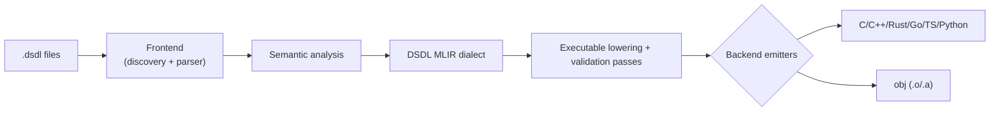

# Architecture

`llvm-dsdl` compiles DSDL through a shared semantic core and a custom MLIR dialect.

## Why this shape

- Single source of truth for semantics
- Strong pass and contract boundaries
- Better backend parity and testability

## Canonical references

- Design source: [DESIGN.md](https://github.com/thirtytwobits/llvm-dsdl/blob/main/DESIGN.md)
- Dialect definitions: `include/llvmdsdl/IR/*`
- Transform passes: `include/llvmdsdl/Transforms/*`, `lib/Transforms/*`
