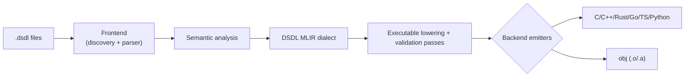

# Architecture

`llvm-dsdl` compiles DSDL through a shared semantic core and a custom MLIR dialect.

## Design goals

- Single source of truth for semantics
- Strong pass and contract boundaries
- Better backend parity and testability

## The dialect is the contract boundary

The custom `dsdl` MLIR dialect is what separates frontend semantics from backend rendering. Everything
above it decides what a definition *means*; everything below it decides how that meaning is spelled in
a particular language.

- Schema and serialisation plans are represented as explicit IR ops, and every fact they carry is a
  declared attribute the verifier checks
- Passes stamp and validate lowered contract metadata
- Backends consume facts from validated lowered state, never from raw IR

### Pass sequence

1. `lower-dsdl-exec`
2. `dsdl-annotate-aliasability` — conservative aliasability *annotator*; stamps metadata only
3. optional `optimize-dsdl-lowered-serdes`
4. `build-dsdl-plan-bodies` — every plan becomes a serialise and a deserialise function of plan operations
5. translation of those functions, one per backend: `convert-dsdl-to-emitc` and EmitC translation for
   C, `convert-dsdl-to-llvm` and `emit-dsdl-runtime` for objects, a translator per language for the
   rest. A backend is this translation and nothing more; `ctest -L backend-contract` reports which
   backends meet that contract (DESIGN.md, *Backend Contract*).

Steps 1 to 4 are the `lower-dsdl-bodies` pipeline, defined once in `lib/Transforms` and registered
with `dsdl-opt` under that name. [Backend Translation](backend-translation.md) records the work of
bringing every backend onto it.

### Boundary guarantees

- Raw or unlowered IR reaching a backend is caught by a contract version and producer-identity guard.
  That guard detects *unlowered state*, not field-level semantic-compatibility drift.
- Backend emitters stay aligned, because every body is a translation of the same plan bodies.
- Unsupported and malformed states produce deterministic diagnostics.

## Canonical references

- Design source: [DESIGN.md](https://github.com/OpenCyphal-Garage/llvm-dsdl/blob/main/DESIGN.md)
- Dialect definitions: `include/llvmdsdl/IR/*`
- Transform passes: `include/llvmdsdl/Transforms/*`, `lib/Transforms/*`
- Lowered contract: `include/llvmdsdl/Transforms/LoweredSerDesContract.h`,
  `lib/Transforms/LoweredSerDesContractValidation.cpp`
